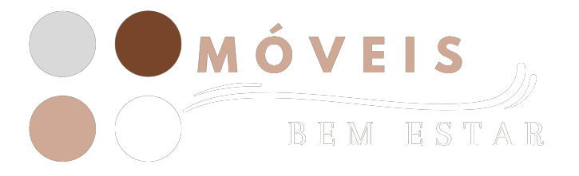
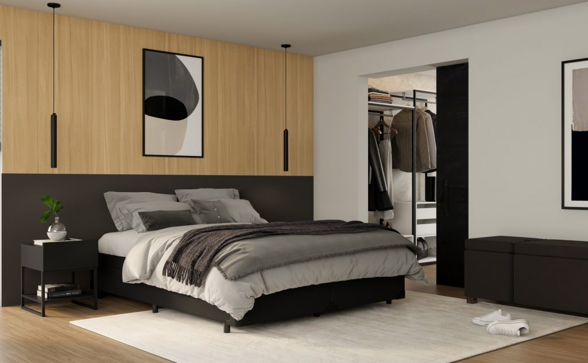
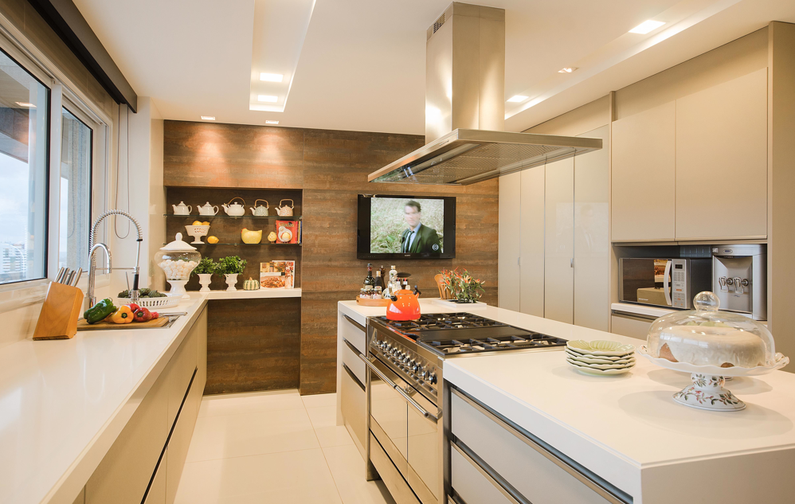
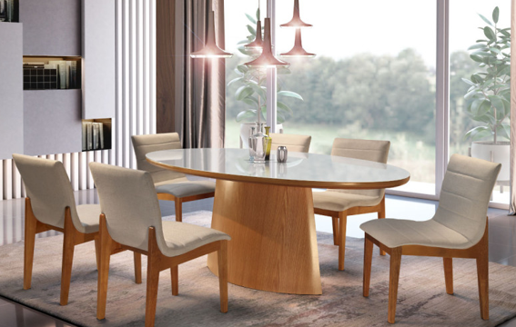
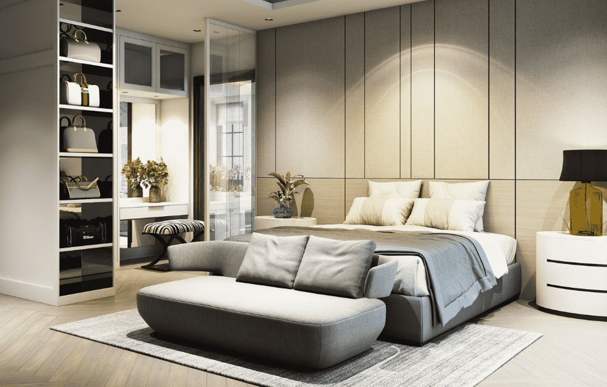
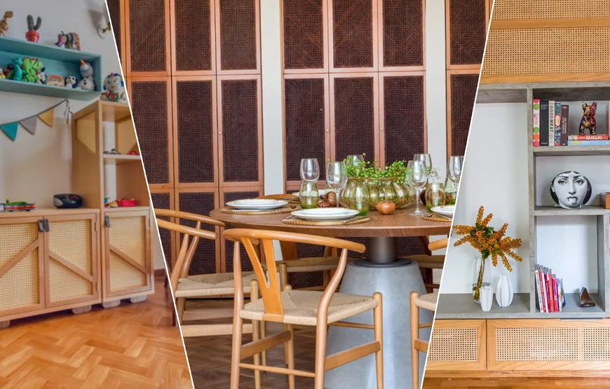

# Site - Código página principal: 
<!DOCTYPE html>
<html lang="pt-br">
<head>
  
    <meta charset="UTF-8">
    <meta http-equiv="X-UA-Compatible" content="IE=edge">
    <meta name="viewport" content="width=device-width, initial-scale=1.0">
    <link rel="stylesheet" href="Style Site Danielly.css.html">
    <title> Site Danielly Goncalves Santos </title>
    <link rel="stylesheet" href="style site Danielly.css">
    <link href="https://cdn.jsdelivr.net/npm/bootstrap@5.3.0/dist/css/bootstrap.min.css" rel="stylesheet" integrity="sha384-9ndCyUaIbzAi2FUVXJi0CjmCapSmO7SnpJef0486qhLnuZ2cdeRhO02iuK6FUUVM" crossorigin="anonymous">"
    <link href="CarrinhoComprasSite.html" rel="stylesheet">
    
    <link href="Codigo site - Danielly Goncalves Santos - Produtos.html" rel="stylesheet">
    <link rel="stylesheet" href="https://cdnjs.cloudflare.com/ajax/libs/font-awesome/6.0.0-beta3/css/all.min.css" integrity="sha512-vX6ufAA9stus6G2nCtHaXKdOvR6oAQOjgUJl4Ri7Lk2NArRfDAxIJQg4kKwG9mI+oGogdHrKvLsZjK8DQIk6A==" crossorigin="anonymous" referrerpolicy="no-referrer" />
    <link rel="stylesheet" href="https://stackpath.bootstrapcdn.com/bootstrap/4.5.2/css/bootstrap.min.css">
    <link rel="stylesheet" href="https://cdnjs.cloudflare.com/ajax/libs/font-awesome/6.0.0-beta3/css/all.min.css">
    
    
    
    
    <link rel="stylesheet" href="https://stackpath.bootstrapcdn.com/bootstrap/5.0.0-alpha2/css/bootstrap.min.css">
    <link rel="stylesheet" href="https://cdnjs.cloudflare.com/ajax/libs/font-awesome/5.15.3/css/all.min.css">
    <link rel="stylesheet" href="https://cdnjs.cloudflare.com/ajax/libs/font-awesome/5.15.3/css/all.min.css">
    <link rel="stylesheet" href="https://cdnjs.cloudflare.com/ajax/libs/font-awesome/5.15.3/css/all.min.css">
    
    
  
  

  </head>
    
<body> 
  <section>
    <header>
           
        <figure>
        
        </figure>
<!-- Icone de cabeçalho -->
        

          <i style="color: #78452b;" class="fas fa-shopping-cart icon"></i>
          <i class="fas fa-user icon"></i>
        

          
  
        
    </header>
  </section>
  
  <!-- Barra de navegação -->
        <nav class="navbar navbar-expand-lg bg-body-tertiary" style="width: 54%;" style="height: 40%" style="border-radius: 10%;">
      

      <button class="navbar-toggler" style="position: relative;" type="button" data-bs-toggle="collapse" data-bs-target="#navbarSupportedContent" aria-controls="navbarSupportedContent" aria-expanded="false" aria-label="Toggle navigation">
      
      </button>
        

        <ul class="navbar-nav me-auto mb-2 mb-lg-0" style="border: 5px;">
        <li class="nav-item">
        <a class="nav-link active" aria-current="page" href="#">&nbsp&nbsp&nbsp&nbsp Quem Somos :) &nbsp&nbsp&nbsp&nbsp&nbsp&nbsp&nbsp</a>
        </li>
          <li class="nav-item dropdown">
          <a class="nav-link dropdown-toggle" href="#" role="button" data-bs-toggle="dropdown" aria-expanded="false">
          Nossos Ambientes
          </a>
          <li class="nav-item">
          <a class="nav-link" href="#">&nbsp&nbsp&nbsp&nbsp&nbsp&nbsp&nbsp&nbsp Projetistas de plantão</a>
          </li>
          <ul class="dropdown-menu">
            <li><a class="dropdown-item" href="#">Sala Estar</a></li>
            <li><a class="dropdown-item" href="#">Cozinha</a></li>
            <li><a class="dropdown-item" href="#">Sala de Jantar</a></li>
            <li><a class="dropdown-item" href="#">Quarto</a></li>
            <li>
</li>
            </ul>
        </li>
        </ul>

          <!-- campode de pesquisa -->
      <form class="d-flex" role="Pesquisa">
        <input class="form-control me-2" style="margin-top: 7px;" type="Pesquisa" placeholder="Pesquisa" aria-label="Pesquisa">
        <button class="btn btn-outline-success"  style="text-align: center;" style="height: 25px;" type="submit">Pesquisa</button>
      </form>
    

  

</nav>

<!-- Script para controlar o carrossel -->

  <!-- Foto principal -->

  

    

      
      

        <h2>Design Exclusivo</h2>
        

        

        

        

        </body>
        </html>
        

  <!-- Detalhe tracejado -->

<h1 style="color: #d9d9d9; margin-top: -25px" >---------------------------------------------------------------------------------</h1>

  
<!-- Primeira sessão de cards (fotos ambientes) -->

  

    

      
      

        <h5 style="text-align: center; font-family:cursive; height: 30px; color: white; background-color:#674c38;  float: inline-start; opacity: 1; border-radius: 5px;"  class="card-title">Cozinhas</h5>
         

      

      

    

  

  

    

      
      

        <h5 style="text-align: center; font-family:cursive; height: 30px; color: white; background-color:#674c38; float: inline-start; opacity: 1; border-radius: 5px;"  class="card-title">Home</h5>
         

      

      

    

  

  

    

      
      

        <h5 style="text-align: center; font-family:cursive; height: 30px; color: white; background-color:#674c38; float: inline-start; opacity: 1; border-radius: 5px;"  class="card-title">Jantar</h5>
         

      

      

    

  

 
 
 
 
 
 

<!-- Segunda sessão de cards (fotos ambientes) -->

  

    

      
      

        <h5 style="text-align: center; font-family:cursive; height: 30px; color: white; background-color:#674c38; float: inline-start; opacity: 1; border-radius: 5px;"  class="card-title">Quarto</h5>
         

      

      

    

  

  

    

      
      

        <h5 style="text-align: center; font-family:cursive; height: 30px; color: white; background-color:#674c38; float: inline-start; opacity: 1; border-radius: 5px;"  class="card-title">Descontos %</h5>
         

      

      

    

  

  

    

      
      

        <h5 style="text-align: center; font-family:cursive; height: 30px; color: white; background-color:#674c38; float: inline-start; opacity: 1; border-radius: 5px;"  class="card-title">Premiações</h5>
      
 
      

      

    

    

 
 
 
 
 
 

  <h1 style="color: #d9d9d9; margin-top: -175px" >________________________&nbsp&nbsp&nbsp&nbsp&nbsp&nbsp&nbsp&nbsp&nbsp&nbsp&nbsp&nbsp&nbsp&nbsp&nbsp&nbsp&nbsp&nbsp&nbsp&nbsp&nbsp&nbsp&nbsp&nbsp&nbsp&nbsp&nbsp&nbsp&nbsp&nbsp&nbsp&nbsp&nbsp&nbsp&nbsp&nbsp&nbsp&nbsp&nbsp&nbsp&nbsp&nbsp&nbsp&nbsp&nbsp_________________________</h1>

<figure style="margin-top: 10px; margin-left: 500px;">

</figure>

 
 

<!-- Footer -->
<footer style="background-color: #674c38; color: #fff; padding: 20px; width: 1296px; margin-top: -40px;">
  

    <!-- Informações de endereço -->
    

      <h3 style="color: #fff;">Onde nos encontrar:</h3>
      
Endereço: Rua das flores, 100 - Centro - São Paulo

      
Telefone: (11) 98765-0000

    

      <!-- Ícones de redes sociais -->
    

      <h3 style="color: #fff; margin-top: -40px; margin-right: 20px;">Redes Sociais&nbsp&nbsp&nbsp&nbsp&nbsp&nbsp&nbsp&nbsp&nbsp</h3>
      <a href="https://www.linkedin.com/in/daniellygoncalvess/" style="color: #fff; text-decoration: none; margin-right: 20px;"><i class="fab fa-linkedin"></i></a>
      <a href="https://github.com/gsdanielly" style="color: #fff; text-decoration: none; margin-right: 20px;"><i class="fab fa-github"></i></a>
      <a href="https://twitter.com/gsdanielly?t=Py27ULtdjZfDSbJmwv1gVQ&s=09" style="color: #fff; text-decoration: none; margin-right: 10px;"><i class="fab fa-twitter"></i></a>
      <a href="https://www.instagram.com/gsdanielly/" style="color: #fff; text-decoration: none; margin-right: 50px;"><i class="fab fa-instagram"></i></a>
    

  

   <!-- Campo de cadastro de usuário -->
   

    <h4 style="color: #2b2927;">Cadastre-se para receber nossas novidades:</h4>
    <form>
      

        <label for="nome"style="color: #000; margin-top: 10px;">&nbsp&nbsp&nbspNome:&nbsp</label>
        <input type="text" id="nome" name="nome" placeholder="Seu nome completo" style="width: 300px; " required>
      

      

        <label for="email" style="color: #2b2927;">&nbsp&nbsp&nbspE-mail:&nbsp</label>
        <input type="email" id="email" name="email" placeholder="seuemail@example.com" style="width: 300px; margin-top: 5px;" required>
      

      

        <label for="telefone" style="color: #2b2927;">Telefone:&nbsp</label>
        <input type="tel" id="telefone" name="telefone" placeholder="(11) 98765-4321" style="width: 300px; margin-top: 5px;" required>
      

      

        <label for="cpf" style="color: #2b2927;">&nbsp&nbsp&nbsp&nbsp&nbsp&nbsp&nbspCPF:&nbsp</label>
        <input type="text" id="cpf" name="cpf" placeholder="000.000.000-00" style="width: 300px; margin-top: 5px;" required>
      

      <button type="submit" style="background-color: #674c38; color: #fff; padding: 10px 20px; margin-top: 20px; border: none; border-radius: 5px; cursor: pointer;">Cadastrar</button>
    </form> 
  

</footer>

<!-- Balão Whattsapp -->

  <!-- Conteúdo da página -->

<!-- Balão de WhatsApp -->

  
Fale com um projetista! :)

  <a href="https://api.whatsapp.com/send?phone=27998139695" target="_blank">
    <i class="fab fa-whatsapp"></i> Nosso WhatsApp
  </a>

 Desenvolvido por: Danielly Gonçalves Santos / Todos os direitos reservados

</body>
</html>
